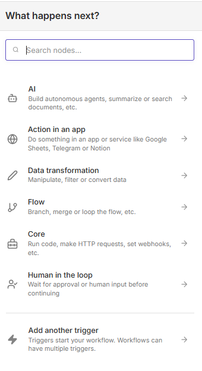
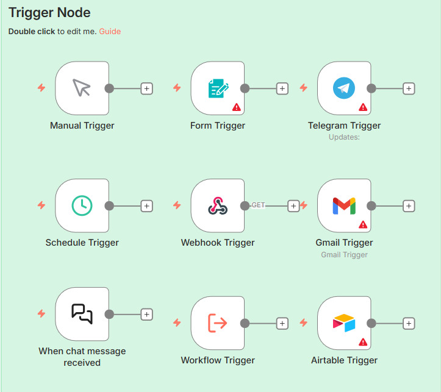
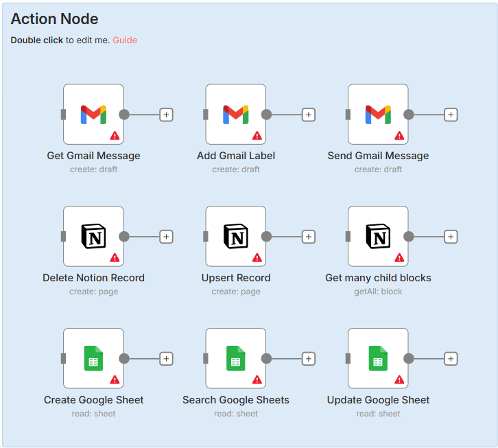
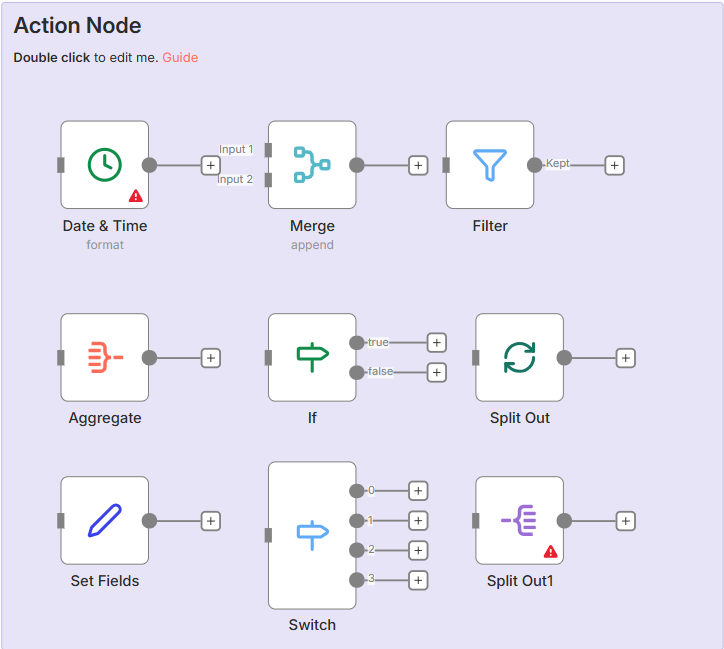
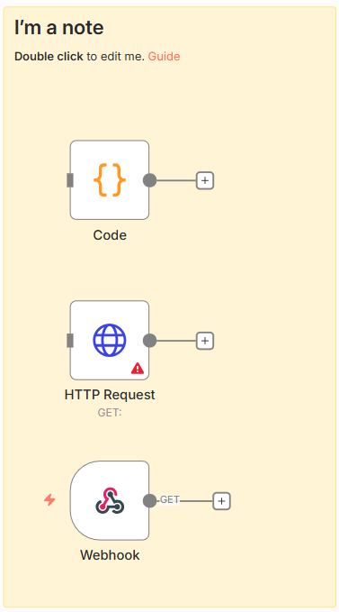
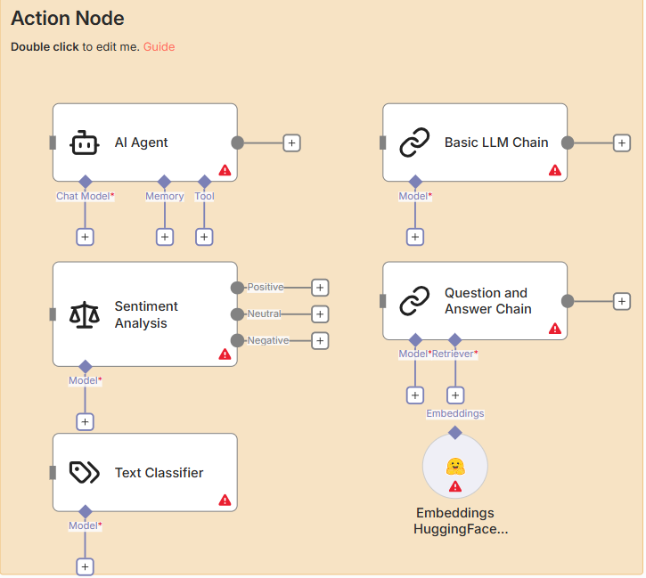

# 📘 Tài liệu tổng hợp các Node trong n8n (Phân loại theo nhóm)

Tài liệu này mô tả các **node phổ biến trong n8n**, được **phân loại theo nhóm chức năng**, giúp bạn dễ hiểu – dễ thiết kế workflow – dễ mở rộng.



---

## 1️⃣ Trigger Nodes (Node kích hoạt Workflow)

Trigger là **điểm bắt đầu** của mọi workflow. Khi sự kiện xảy ra, workflow sẽ được chạy.

| Node | Mô tả | Trường hợp dùng |
|------|-------|-----------------|
| **Manual Trigger** | Chạy workflow thủ công | Test, debug workflow |
| **Schedule Trigger** | Chạy theo lịch (cron) | Chạy hàng ngày, hàng giờ tự động |
| **Webhook Trigger** | Nhận request HTTP từ bên ngoài | API, bot, hệ thống bên thứ ba |
| **Form Trigger** | Kích hoạt khi user submit form | Nhận input từ form web |
| **Telegram Trigger** | Kích hoạt khi bot Telegram nhận message | Bot tự động trả lời |
| **Gmail Trigger** | Kích hoạt khi có email mới | Tự động xử lý email đến |
| **Airtable Trigger** | Kích hoạt khi record thay đổi | Đồng bộ dữ liệu Airtable |
| **Workflow Trigger** | Workflow này được gọi bởi workflow khác | Gọi lại từ workflow khác |


---

## 2️⃣ Action Nodes (Node thao tác với dịch vụ)

Dùng để **tạo – đọc – cập nhật – xóa dữ liệu** từ các nền tảng khác nhau.

| Dịch vụ | Node | Chức năng |
|---------|------|----------|
| **Gmail** | Get Email Message | Lấy nội dung email |
| **Gmail** | Send Email | Gửi email |
| **Gmail** | Add / Remove Label | Gán nhãn email |
| **Notion** | Create Record | Tạo mục mới |
| **Notion** | Update Record | Cập nhật mục |
| **Notion** | Delete Record | Xóa mục |
| **Notion** | Get Many Blocks | Lấy dữ liệu |
| **Google Sheets** | Create Spreadsheet | Tạo file sheet mới |
| **Google Sheets** | Search Rows | Tìm hàng theo điều kiện |
| **Google Sheets** | Update Rows | Cập nhật hàng |

👉 **Thường dùng cho:**

- Lưu log
- Đồng bộ dữ liệu
- Gửi thông báo



---

## 3️⃣ Data Processing Nodes (Xử lý dữ liệu)

Nhóm node dùng để **biến đổi, lọc, gộp, tách dữ liệu**.

| Node | Chức năng | Ví dụ sử dụng |
|------|----------|----------------|
| **Set** | Gán hoặc chỉnh sửa field dữ liệu | Thêm trường mới, sửa giá trị |
| **Merge** | Gộp dữ liệu từ nhiều nhánh | Kết hợp kết quả từ nhiều nguồn |
| **IF** | Rẽ nhánh theo điều kiện | Kiểm tra điều kiện, chọn đường đi |
| **Filter** | Lọc item theo điều kiện | Chỉ lấy dữ liệu phù hợp |
| **Aggregate** | Gom nhóm, tính toán (count, sum…) | Tính tổng, đếm, gộp dữ liệu |
| **Switch** | Rẽ nhánh nhiều điều kiện | Nhiều điều kiện logic |
| **Split In Batches / Split Out** | Chia dữ liệu để xử lý lần lượt | Xử lý từng batch dữ liệu |
| **Date & Time** | Format, cộng/trừ thời gian | Định dạng ngày giờ, tính toán |

👉 **Đây là xương sống logic của workflow**


---

## 4️⃣ Utility / Integration Nodes

Nhóm node hỗ trợ kết nối và xử lý nâng cao.

| Node | Chức năng | Trường hợp dùng |
|------|----------|-----------------|
| **Code** | Viết JavaScript để xử lý logic phức tạp | Custom logic, xử lý đặc biệt |
| **HTTP Request** | Gọi API REST (GET / POST / PUT / DELETE) | Kết nối API bên ngoài |
| **Webhook (Action)** | Gửi dữ liệu ra ngoài qua HTTP | Gửi hook đến hệ thống khác |

👉 **Dùng khi:**

* Tích hợp hệ thống custom
* Gọi API bên thứ ba



---

## 5️⃣ AI / LLM Nodes (Trí tuệ nhân tạo)

Nhóm node dành cho **AI Agent, LLM, NLP**.

| Node | Chức năng | Trường hợp dùng |
|------|----------|-----------------|
| **AI Agent** | Agent có memory, tool, reasoning | Tạo agent thông minh |
| **Basic LLM Chain** | Chuỗi xử lý prompt → output | Gọi LLM đơn giản |
| **Question & Answer Chain** | Hỏi – đáp trên dữ liệu | Q&A dựa trên dữ liệu |
| **Text Classifier** | Phân loại văn bản | Phân loại nội dung |
| **Sentiment Analysis** | Phân tích cảm xúc (positive / negative) | Phân tích tâm trạng |
| **Embeddings** | Chuyển text thành vector (dùng cho search, RAG) | Tìm kiếm semantic, RAG |

👉 **Rất phù hợp cho:**

* Chatbot
* AI assistant
* Tự động phân tích nội dung



---

## 🧭 Gợi ý thiết kế Workflow chuẩn

```text
Trigger
  ↓
Data Processing (Set / IF / Filter)
  ↓
Action (Send mail / Save DB / Call API)
  ↓
AI (nếu cần)
```

---

## ✅ Kết luận

* **Trigger**: Bắt đầu workflow
* **Processing**: Xử lý logic
* **Action**: Tương tác dịch vụ
* **Utility**: Mở rộng khả năng
* **AI**: Thông minh hóa workflow

📌 Nếu bạn muốn, mình có thể:

* Vẽ sơ đồ workflow mẫu
* Viết doc cho **từng node chi tiết hơn**
* Hướng dẫn **best practice khi dùng n8n**
