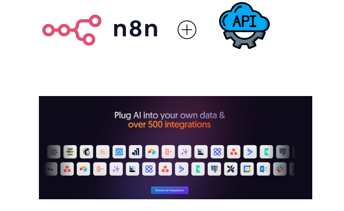
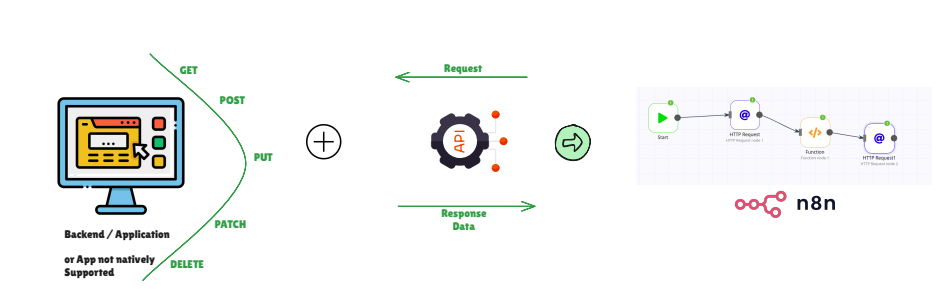
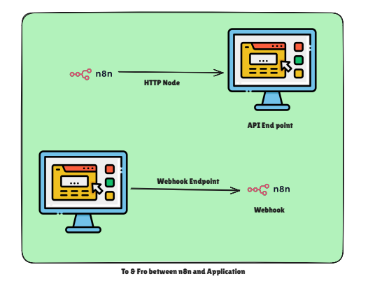
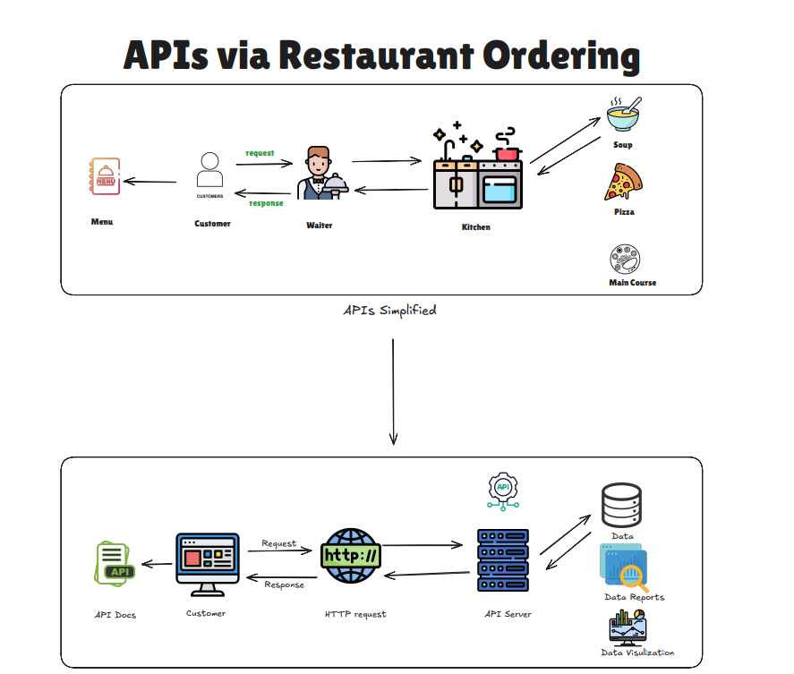

## 🧪 cURL Basics

| Concept | Explanation | Example | Restaurant Analogy |
|-------|------------|---------|--------------------|
| **What is cURL?** | cURL là công cụ dòng lệnh cho phép bạn gửi request API trực tiếp từ terminal. Nó mô phỏng cách client giao tiếp với server qua HTTP. | `curl https://api.example.com/menu` | Thay vì hỏi phục vụ trực tiếp, bạn gọi điện thẳng cho nhà hàng để đặt món. |
| **Basic GET Request** | Dùng để lấy dữ liệu từ một API endpoint. | `curl https://api.example.com/menu` | Bạn gọi nhà hàng: “Đọc cho tôi menu hôm nay.” |
| **Adding Headers** | Gửi thêm thông tin như xác thực hoặc định dạng dữ liệu. | `curl -H "Authorization: Bearer TOKEN" https://api.example.com/order` | Bạn nói qua điện thoại: “Tôi là khách VIP, đây là mã thành viên của tôi.” |
| **POST Request (Send Data)** | Tạo resource mới bằng cách gửi JSON hoặc form data trong body. | `curl -X POST -H "Content-Type: application/json" -d '{"dish":"Pizza"}' https://api.example.com/order` | Bạn gọi: “Tôi muốn đặt một pizza mới.” |
| **PUT / PATCH Request (Update)** | Cập nhật resource đã tồn tại. | `curl -X PUT -d '{"dish":"Pasta"}' https://api.example.com/order/123` | Bạn gọi lại: “Đổi đơn của tôi từ pizza sang pasta.” |
| **DELETE Request** | Xóa resource khỏi server. | `curl -X DELETE https://api.example.com/order/123` | Bạn gọi: “Hủy đơn #123 giúp tôi, tôi không ăn nữa.” |
| **Verbose Mode** | Hiển thị chi tiết toàn bộ request và response (headers, timing…). | `curl -v https://api.example.com/menu` | Khi gọi điện, bạn nghe toàn bộ cuộc trao đổi giữa lễ tân và bếp. |
| **Why Use cURL?** | - Test API nhanh không cần app - Debug lỗi - Tự động hóa trong script | Dev dùng cURL để test endpoint trước khi tích hợp vào app | Gọi trước cho nhà hàng để hỏi: “Hôm nay còn pasta không?” |

# 📘 Tổng Quan Các Khái Niệm API

| Khái Niệm | Giải Thích | Ví Dụ | Phép Ẩn Dụ |
|-------|------------|---------|---------|
| **API** | Cách để hai hệ thống giao tiếp với nhau. Client gửi request, server trả lời. | Khách hàng yêu cầu đồ ăn, bếp chuẩn bị và trả lại. | Phục vụ mang yêu cầu của bạn đến bếp và mang đồ ăn trở lại. |
| **REST API** | API tiêu chuẩn sử dụng các phương thức HTTP để tương tác với tài nguyên. | Menu liệt kê tất cả các món ăn có sẵn (mỗi cái có quy tắc). | Thực đơn nhà hàng với các món ăn tiêu chuẩn. |
| **HTTP Methods** | Các hành động bạn có thể thực hiện trên tài nguyên. | `GET` Đọc menu `POST` Gọi pizza `PUT` Thêm phô mai vào pizza `DELETE` Hủy đơn | Cách khách hàng gọi, sửa đổi hoặc hủy đồ ăn. |
| **Endpoints** | "Địa chỉ" duy nhất cho mỗi tài nguyên. | `/pasta` hoặc `/pizza` endpoint để gọi một món cụ thể. | Mỗi món ăn có mã menu hoặc số hiệu item. |
| **Query Parameters** | Các tùy chọn tùy chỉnh được thêm vào request. | `/pasta?glutenFree=true&spicy=extra` | "Tôi muốn mì ống, không gluten, cay extra." |
| **Headers** | Thông tin bổ sung được gửi kèm request. | `Content-Type: application/json` | "Không có hành" hoặc "Đóng hộp đi." |
| **Authentication** | Bằng chứng cho phép bạn truy cập dịch vụ. | Thẻ thành viên bắt buộc trước khi gọi món. | Xuất trình vé hoặc thẻ thành viên để dine in. |
| **API Documentation** | Giải thích cách sử dụng API (endpoints, methods, examples). | Tài liệu Stripe API giải thích cách xử lý thanh toán. | Menu giải thích các món ăn có sẵn và quy tắc. |
| **Response** | Dữ liệu được server trả lại. | Bếp trả lại mì ống đã nấu cho khách hàng. | Phục vụ mang đồ ăn ra bàn. |
| **Response Codes** | Trạng thái của request. | `200 OK` – Món ăn được phục vụ `404` – Món không trong menu `401` – Không có reservation `500` – Bếp cháy | Thông báo phản hồi về trạng thái đơn hàng của bạn. |
| **Error Handling** | Biết tại sao request thất bại và phản ứng thích hợp. | "Xin lỗi, hôm nay không có mì ống." | Giải thích rõ ràng khi không thể phục vụ. |
| **Rate Limiting** | Hạn chế số lượng requests trong thời gian ngắn. | Khách hàng cố gọi 100 món cùng lúc → bị từ chối. | Nhà hàng không chấp nhận đơn hàng quá lớn không thực tế. |
| **Pagination** | Chia dữ liệu lớn thành các bộ nhỏ hơn. | Menu với 10 món ăn mỗi trang. | Phục vụ chỉ cho bạn xem một trang menu lúc một. |
| **Webhooks** | Server thông báo cho client khi có sự kiện xảy ra. | Phục vụ gọi bạn khi đồ ăn sẵn sàng. | Để lại số điện thoại, phục vụ gọi khi món ăn xong. |
| **Versioning** | Hỗ trợ nhiều phiên bản khi API phát triển. | `/v1/pizza` so với `/v2/pizza` | Nhà hàng giới thiệu menu mới nhưng vẫn hỗ trợ các món cũ. |

## 🔐 Authentication Methods

| Authentication Method | Explanation | Example | Analogy |
|----------------------|------------|---------|---------|
| **No Auth (Open Access)** | API có thể được truy cập bởi bất kỳ ai, không cần xác thực. Rất hiếm khi dùng cho hệ thống bảo mật. | `GET /menu` – Ai cũng xem được menu mà không cần đăng nhập. | Quầy đồ ăn đường phố – ai đến cũng mua, không cần thẻ hay giấy tờ. |
| **API Key (Query/Header)** | Một key duy nhất được gửi kèm mỗi request để xác định người dùng. Thường đặt trong query string hoặc header. | `GET /menu?apikey=12345` | Đưa thẻ thành viên mỗi lần vào nhà hàng. |
| **Basic Auth** | Gửi `username` và `password` trong mỗi request (được encode, không mã hóa). | Header: `Authorization: Basic dXNlcjpwYXNz` | Ghi tên và chữ ký lên mỗi hóa đơn khi gọi món. |
| **Digest Auth** | Phiên bản cải tiến của Basic Auth, dùng mật khẩu đã được hash → an toàn hơn. | Request gửi header với giá trị đã hash | Không đưa mật khẩu thật, mà đưa mã bí mật thay đổi mỗi lần. |
| **Bearer Token (Header Auth)** | Token (như thẻ kỹ thuật số) được gửi trong header. Phổ biến trong API hiện đại. | Header: `Authorization: Bearer eyJhbGci...` | Đưa thẻ VIP cho phục vụ để được phục vụ nhanh. |
| **OAuth 1.0** | Hệ thống cũ, dùng chữ ký (signature) cho request. | Dùng trong một số API ngân hàng / tài chính cũ | Ký giấy xác nhận danh tính trước mỗi lần gọi món. |
| **OAuth 2.0** | Chuẩn hiện đại, phổ biến. Đăng nhập 1 lần (Google, GitHub, etc.) để lấy token dùng cho các request sau. | Đăng nhập Google → nhận access token → gọi API | Check-in 1 lần ở quầy lễ tân, nhận vòng tay dùng cả ngày. |
| **Header Auth (Custom)** | Header key-value tùy chỉnh do API yêu cầu. | `X-API-Key: 12345` | Nhà hàng chỉ phục vụ nếu bạn nói đúng mật khẩu. |
| **Query Auth** | Thông tin xác thực nằm trong URL (kém an toàn). | `/order?user=rayank&pass=123` | La to mật khẩu giữa nhà hàng 😅 |
| **Custom Auth** | Cơ chế xác thực riêng, kết hợp header, token, body hoặc chữ ký. | Một số API yêu cầu ký request bằng secret key | Nhà hàng VIP có luật riêng – cần ID + mã + đặt chỗ. |

## 🔄 HTTP Methods

| Method | Explanation | Example | Analogy |
|-------|------------|---------|---------|
| **GET** | Dùng để **lấy dữ liệu** từ server. Không làm thay đổi dữ liệu, chỉ đọc. | `GET /menu` → Lấy danh sách món ăn | Bạn đọc menu nhà hàng mà chưa gọi món. |
| **POST** | Dùng để **tạo mới** một resource. Dữ liệu được gửi trong request body. | `POST /order` với `{ "dish": "Pizza", "size": "Large" }` → Tạo đơn hàng mới | Bạn nói với phục vụ: “Cho tôi 1 pizza cỡ lớn.” |
| **PUT** | Dùng để **cập nhật toàn bộ** resource hiện có. Thay thế bản cũ bằng bản mới. | `PUT /order/123` với `{ "dish": "Pasta", "size": "Medium" }` | Hủy pizza và đổi hoàn toàn sang pasta. |
| **PATCH** | Dùng để **cập nhật một phần** resource. Chỉ thay đổi các field được gửi. | `PATCH /order/123` với `{ "size": "Extra Large" }` | Đổi size pizza sang lớn hơn, không đổi món. |
| **DELETE** | Dùng để **xóa** resource khỏi server. | `DELETE /order/123` → Hủy đơn hàng | Bạn nói: “Hủy đơn giúp tôi, tôi không ăn nữa.” |

## 📡 HTTP Response Codes

| Response Code | Category | Explanation | Restaurant Analogy |
|--------------|----------|-------------|--------------------|
| **200 OK** | ✅ Success | Request xử lý thành công và server trả đúng dữ liệu yêu cầu. | Bạn gọi pizza và phục vụ mang đúng pizza ra bàn. |
| **201 Created** | ✅ Success | Resource mới đã được tạo thành công. | Bạn đặt món mới, phục vụ xác nhận: “Pizza của bạn đang được chuẩn bị.” |
| **204 No Content** | ✅ Success | Request thành công nhưng không có dữ liệu trả về. | Bạn hủy đơn, phục vụ nói “Xong rồi” nhưng không mang gì ra. |
| **400 Bad Request** | ❌ Client Error | Request không hợp lệ hoặc thiếu dữ liệu. | Bạn nói “Cho tôi món ngon”, phục vụ không hiểu bạn muốn gì. |
| **401 Unauthorized** | ❌ Client Error | Chưa xác thực hoặc thông tin xác thực không hợp lệ. | Bạn vào nhà hàng thành viên mà không có thẻ. |
| **403 Forbidden** | ❌ Client Error | Đã xác thực nhưng không có quyền truy cập. | Bạn có thẻ nhưng cố vào khu vực bếp – bị chặn. |
| **404 Not Found** | ❌ Client Error | Resource không tồn tại. | Bạn gọi “Dragon Soup” nhưng món đó không có trong menu. |
| **405 Method Not Allowed** | ❌ Client Error | HTTP method không được hỗ trợ cho endpoint này. | Bạn đòi “hủy nước lọc” – phục vụ bảo không thể làm vậy. |
| **429 Too Many Requests** | ❌ Client Error | Gửi quá nhiều request trong thời gian ngắn. | Bạn gọi phục vụ liên tục, họ bảo: “Làm ơn chờ chút.” |
| **500 Internal Server Error** | 🚨 Server Error | Lỗi không mong muốn xảy ra ở server. | Bếp cháy, món ăn không thể làm. |
| **502 Bad Gateway** | 🚨 Server Error | Server nhận phản hồi lỗi từ server khác. | Phục vụ hỏi bếp trưởng, nhưng bếp trả lời loạn xạ. |
| **503 Service Unavailable** | 🔥 Server Error | Server đang quá tải hoặc tạm thời không hoạt động. | Nhà hàng đã kín chỗ, phục vụ nói: “Hiện tại chúng tôi không nhận thêm đơn.” |
| **504 Gateway Timeout** | 🔥 Server Error | Server không nhận được phản hồi kịp thời từ server khác. | Phục vụ hỏi bếp nhưng bếp không trả lời, nên đành bỏ cuộc. |

## 📦 Query Parameters vs Headers vs Body

| Feature | Query Parameters | Headers | Body |
|-------|------------------|---------|------|
| **Purpose** | Lọc hoặc điều chỉnh request | Cung cấp metadata hoặc context | Gửi dữ liệu / nội dung chính |
| **Location** | Nằm trong URL sau dấu `?` (vd: `/menu?type=veg&sort=price`) | Nằm trong phần header của request | Nằm trong payload của request |
| **Visibility** | Hiển thị trực tiếp trên URL | Ẩn trong header | Ẩn (không nằm trong URL) |
| **Data Type** | Cặp key–value đơn giản | Metadata dạng key–value | Dữ liệu có cấu trúc (JSON, XML, form) |
| **Use Case** | Search, filter, sort, pagination | Authentication, content-type, ngôn ngữ, version | Tạo mới hoặc cập nhật resource |
| **Typical HTTP Methods** | GET | Tất cả (GET, POST, PUT, DELETE, …) | Thường là POST, PUT, PATCH |
| **Example** | `/orders?status=pending&page=2` | `Authorization: Bearer <token>` `Content-Type: application/json` | `{ "item": "pizza", "size": "large" }` |
| **Size Limit** | Nhỏ (giới hạn bởi độ dài URL) | Nhỏ | Lớn (phù hợp dữ liệu nhiều) |
| **Majorly Used When** | Cần lấy dữ liệu kèm điều kiện | Cần truyền credential hoặc rule | Cần gửi hoặc cập nhật dữ liệu |
