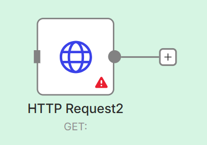

## 🌐 Hiểu về API và Node HTTP Request trong n8n

API (Application Programming Interfaces) là cách mà các ứng dụng khác nhau **giao tiếp với nhau**.  
Trong n8n, **node HTTP Request** là cách phổ quát để kết nối với bất kỳ API nào.

---

### 🍽️ Giải thích API bằng những ví dụ dễ hiểu

**1. Ví dụ về Nhà hàng (Cổ điển)**  
- Bạn (khách hàng) gọi đồ ăn → yêu cầu API.  
- Người phục vụ (API) chuyển đơn đến bếp (máy chủ).  
- Bếp chuẩn bị → API xử lý yêu cầu.  
- Người phục vụ mang đồ ăn về → phản hồi API.  

**2. Máy ATM**  
- Đưa thẻ + yêu cầu rút tiền → yêu cầu API.  
- ATM nói chuyện với máy chủ ngân hàng → xử lý API.  
- ATM cung cấp tiền cho bạn → phản hồi API.  

**3. Quầy gọi đồ ăn qua ô cửa sổ**  
- Nói đơn hàng vào loa → yêu cầu API.  
- Nhân viên chuẩn bị → máy chủ xử lý.  
- Lấy đồ ăn tại cửa sổ → phản hồi API.  

---

### 🧠 Kiến thức cơ bản về API

- **API = Quy tắc giao tiếp** giữa các ứng dụng.  
- Hầu hết API sử dụng **HTTP** (giao thức web).  
- Yêu cầu được thực hiện bằng các phương thức HTTP:  
  - **GET** → Lấy thông tin.  
  - **POST** → Gửi dữ liệu mới.  
  - **PUT/PATCH** → Cập nhật dữ liệu hiện có.  
  - **DELETE** → Xóa dữ liệu.  

---

## 🛠️ Node HTTP Request trong n8n

Node này cho phép bạn gọi bất kỳ API nào. Hãy phân tích các tùy chọn của nó.



### 1. Phương thức (Method)
- Xác định điều bạn muốn làm.  
- Ví dụ:  
  - GET: Lấy chi tiết thời tiết.  
  - POST: Tạo một liên hệ mới.  

### 2. URL
- The endpoint (address) of the API.  
- Example: `https://api.openweathermap.org/data/2.5/weather?q=Delhi`  

### 3. Authentication
- Many APIs require keys/tokens to identify you.  
- Types: None, Basic Auth, API Key, OAuth2.  

### 4. Tham số truy vấn (Query Parameters)
- Thông tin bổ sung trong URL.  
- Ví dụ: `?limit=10&sort=asc` → `https://api.site.com/users?limit=10&sort=asc`.  

### 5. Headers
- Metadata about the request.  
- Example:  
  - `Content-Type: application/json`  
  - `Authorization: Bearer <token>`  

### 6. Phần thân (Body)
- Dữ liệu bạn gửi (được sử dụng trong POST, PUT, PATCH).  
- Ví dụ:  
```json
{
  "name": "Mayank Agarwal",
  "email": "mayank@example.com"
}
```

### 7. Options
- Advanced settings like timeouts, redirects, or full response mode.

---

## 🔄 Chu kỳ Yêu cầu → Phản hồi

1. **Request:** Method + URL + headers + body.  
2. **Server:** Processes your request.  
3. **Response:** JSON data comes back.  

Ví dụ phản hồi:  
```json
{
  "id": 101,
  "status": "success",
  "createdAt": "2025-09-02T12:00:00Z"
}
```

---

## 📚 Examples with Mayank

1. **Simple GET (Weather Data)**  
   - URL: `https://api.openweathermap.org/data/2.5/weather?q=Delhi&appid=YOUR_API_KEY`  
   - Output: Weather info for Delhi.  

2. **POST (Create Contact in Airtable)**  
   - URL: `https://api.airtable.com/v0/app123/Contacts`  
   - Headers: `Authorization: Bearer YOUR_KEY`  
   - Body:  
   ```json
   {
     "fields": {
       "Name": "Mayank Agarwal",
       "Role": "Automation Trainer"
     }
   }
   ```

3. **PUT (Update Task in Project Tool)**  
   - Update Mayank’s task status to “Completed.”  

4. **DELETE (Remove Test Record)**  
   - Delete a dummy contact entry for Mayank.  

---

## ✅ Key Takeaways

- API là **cầu nối** giữa các ứng dụng.  
- Trong n8n, **node HTTP Request** là cách bạn vượt qua cây cầu đó.  
- Luôn suy nghĩ theo các khía cạnh:  
  - **Method** → Tôi muốn làm gì?  
  - **URL** → Tôi đang làm nó ở đâu?  
  - **Headers/Auth** → Tôi có được phép không?  
  - **Body/Params** → Tôi đang gửi những chi tiết gì?  
- Responses dưới dạng JSON → sẵn sàng để sử dụng trong node tiếp theo.
---

### 🔗 Kết nối với tôi

Muốn tìm hiểu cách xây dựng logic controller-agent trong n8n bằng LLM và điều kiện?

📺 **YouTube** → [@tech.mayankagg](https://www.youtube.com/@tech.mayankagg)  
💼 **LinkedIn** → [Mayank Agarwal](https://www.linkedin.com/in/mayank953/)  
📸 **Instagram** → [@tech.mayankagg](https://www.instagram.com/tech.mayankagg/)

---

*Được chia sẻ bởi Mayank Agarwal – Dạy các quy trình công việc AI thực sự có thể mở rộng.*
