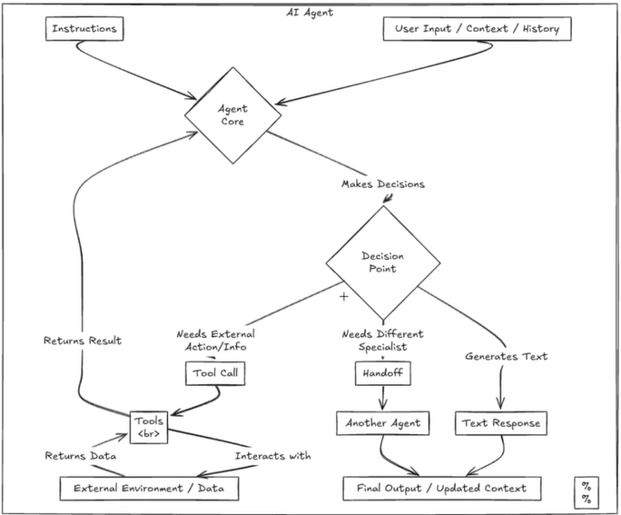
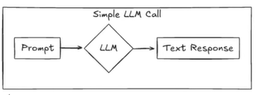
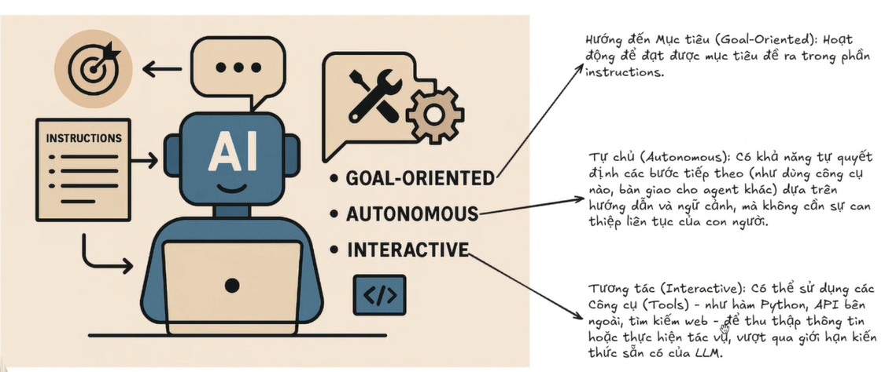

Hướng Dẫn Xây Dựng AI Agent (Phần 1): AI Agent Là Gì & Cài Đặt OpenAI Agents SDK

Chào mừng bạn đến với phần đầu tiên trong series hướng dẫn xây dựng AI Agent của riêng mình! Nếu bạn tò mò AI Agent là gì, làm thế nào để tự tạo một AI cá nhân, thì series này là dành cho bạn.

Trong video này (Phần 1), chúng ta sẽ cùng nhau:
✅ Tìm hiểu AI Agent là gì trong hệ sinh thái của OpenAI (OpenAI Assistants API / Agent SDK).
✅ Khám phá khả năng, tính tự chủ và cách AI Agent tương tác thông qua các công cụ.
✅ Lý do tại sao chọn framework của OpenAI để bắt đầu.
✅ Hướng dẫn chi tiết từng bước cài đặt môi trường phát triển với Python và UV (Python Package Manager).
✅ Cài đặt thư viện cần thiết của OpenAI.
✅ Cách lấy và cấu hình OpenAI API Key.
✅ Viết và chạy thành công một AI Agent đơn giản đầu tiên ("Hello World" agent).

Video này phù hợp cho những ai muốn tìm hiểu và bắt tay vào việc xây dựng AI Agent, từ những khái niệm cơ bản đến việc setup môi trường và chạy được dòng code đầu tiên. Không yêu cầu kiến thức sâu về AI, chỉ cần bạn có hứng thú và một chút quen thuộc với Python.

Đây là nền tảng vững chắc để chúng ta đi sâu hơn vào các phần tiếp theo của series, nơi chúng ta sẽ khám phá cách sử dụng Tools, điều phối Agent, các mô hình nâng cao và hơn thế nữa!

#AIAgent #HuongDanAIAgent #CachTaoAIAgent #XayDungAIAgent #OpenAI #Python #AICaNhan #OpenAIAssistants #LapTrinhAI

🕒 TIMESTAMPS:
00:00 - Giới thiệu Series & Mục tiêu video P1
01:05 - Tại sao chọn OpenAI Assistants API (Agent SDK)?
    - Hiểu khái niệm AI Agent (tác tủ AI) và các ứng dụng tiềm năng.
    - Thiết lập thành công môi trường phát triển Python bằng UV.
    - Cài đặt gói openai-agents-python bằng uv và requirements.txt
    - Cấu hình Open API key cần thiết bằng tệp .env.
    - Tạo và chạy một agent "Hello World" cơ bản bằng SDK.
04:01 - AI Agent là gì? (Định nghĩa, khả năng, tự chủ theo OpenAI)
    - AI agent là mô hình được hỗ trợ bằng 1 mô hình LLM (Lag language model) thiết kế để hiểu hướng dẫn mình đưa vào đưa ra được quyết định và thực hiện những hành động để mình có thể đạt được những mục tiêu cụ thể.
    
    - Có tính tự chủ nhất định với mục tiêu mà mình đã đưa ra ở Instructions thì nó sẽ hoạt động từng bước có khả năng quyết định là nên sử dụng công cụ nào (hay là khi nào thì nên bàn giao nhiệm vụ và không cần phải chờ đợi đến sự quyết định của chúng ta) (Tính tự chủ này dựa trên khả năng resioning của các con LLM dựa vào hướng dẫn đầu vào và dựa vào context cái ngữ cảnh mà nó được cung cấp).
    
    

05:15 - Hướng dẫn cài đặt môi trường (Python, UV, Virtual Env)
07:22 - Cài đặt thư viện OpenAI & thiết lập API Key
09:47 - Demo: Code và chạy AI Agent "Hello World" đơn giản
11:12 - Tổng kết và Hẹn gặp ở Phần 2

🔗 Liên kết hữu ích (Nếu có):
Link cài đặt UV: https://docs.astral.sh/uv/
Mã nguồn ví dụ: https://github.com/draphonix/storage/tree/main/016_ai_agents_001

👍 Nếu bạn thấy video hữu ích, đừng quên Like, Share và Subscribe để không bỏ lỡ các phần tiếp theo trong series "Hướng dẫn xây dựng AI Agent" nhé! Hãy để lại bình luận nếu bạn có bất kỳ câu hỏi nào.

Làm Chủ AI Agent Với OpenAI (P2): Hướng Dẫn Chi Tiết Agent, Runner & Xử Lý Kết Quả

Chào mừng bạn quay trở lại Phần 2 của series Hướng dẫn xây dựng AI Agent! Tiếp nối Phần 1, Trong video này, chúng tôi sẽ hướng dẫn bạn cách tạo và quản lý AI Agent với OpenAI. Xem ngay để biết cách làm chủ Agent, Runner và xử lý kết quả một cách chi tiết!

Trong video này, chúng ta sẽ cùng làm rõ:
✅ *Agent Class:* Các tham số quan trọng (name, instruction, model, tools, handoff, output_type) và cách chúng định hình hành vi của Agent. Đặc biệt nhấn mạnh tầm quan trọng của việc viết `instruction` (chỉ dẫn) chi tiết và rõ ràng.
✅ *Runner Class:* Cách thực thi Agent với 3 phương thức khác nhau:
`run_sync`: Chạy đồng bộ (đợi hoàn thành).
`run` (async): Chạy bất đồng bộ (không đợi, cần `asyncio`).
`run_stream`: Chạy bất đồng bộ và nhận kết quả liên tục (streaming).
✅ *So sánh và Demo* chi tiết cho từng cách chạy (Sync, Async, Stream) để thấy sự khác biệt.
✅ *RunResult & RunResultStreaming:* Hiểu cấu trúc dữ liệu trả về sau mỗi lần chạy Agent. Các thuộc tính quan trọng như `final_output`, `last_agent`, `new_items`.
✅ *Quản lý hội thoại:* Cách sử dụng `RunResult.to_input_list()` để lấy lịch sử và duy trì ngữ cảnh cho các lượt tương tác tiếp theo với AI Agent.

Video này sẽ giúp bạn hiểu rõ hơn về cách một AI Agent hoạt động, các cách để chạy nó, và làm thế nào để xử lý kết quả cũng như duy trì một cuộc hội thoại liền mạch. Đây là kiến thức nền tảng cực kỳ quan trọng để xây dựng các AI Agent phức tạp hơn.

Phù hợp cho những ai đã xem Phần 1 hoặc đã có kiến thức cơ bản về OpenAI Assistants API/SDK và muốn tìm hiểu sâu hơn về cách vận hành và quản lý Agent.

#AIAgent #HuongDanAIAgent #CachTaoAIAgent #XayDungAIAgent #OpenAI #Python #AICaNhan #OpenAIAssistants #RunnerClass #RunResult #AsyncIO #Streaming

🕒 TIMESTAMPS:
00:00 - Giới thiệu Module 2: Core Agent Concepts & Mục tiêu bài học
00:44 - Chi tiết về Agent Class: Các tham số (name, instruction, model, tools, handoff, output_type)
02:31 - Tầm quan trọng của Instruction (Chỉ dẫn) & Ví dụ chi tiết với Translator Agent
05:00 - Tìm hiểu Runner Class & Giới thiệu 3 cách chạy Agent
05:26 - Cách chạy 1: Đồng bộ (run_sync)
07:38 - Demo: Chạy Agent Đồng Bộ (run_sync)
08:38 - Cách chạy 2: Bất đồng bộ (run với asyncio)
09:12 - Demo: Chạy Agent Bất Đồng Bộ (run với asyncio)
11:10 - Cách chạy 3: Streaming (run_stream)
11:12 - Demo: Chạy Agent Streaming (run_stream)
12:18 - So sánh 3 cách chạy & Tóm tắt bằng ví dụ bình luận bóng đá
13:46 - Giải thích kết quả trả về: RunResult/RunResultBase (final_output, last_agent, new_items...)
17:13 - Cách duy trì hội thoại: Sử dụng `RunResult.to_input_list()`
18:23 - Demo: Giữ mạch hội thoại qua nhiều lượt chạy
21:03 - Tổng kết Module 2 & Lời kêu gọi hành động

🔗 Liên kết hữu ích (Nếu có):
Mã nguồn ví dụ (GitHub Gist/Repo): https://github.com/draphonix/storage/tree/main/017_ai_agents_002

Nếu intruction không rõ ràng thì nó có hoàn toàn dẫn đến việc là hành vi của con ai agent nó không như mong muốn và khó có thể kiểm soát.
- Một cái chỉ dẫn tốt thì thường bao gồm những yếu tố là vai trò, nhiệm vụ chính, quy tắc, giới hạn và cuối cùng là định dạng đầu ra mong muốn

Cách Tạo AI Agent (P3): Tăng Cường Khả Năng Với Tools - Function Calling, Search & Agent as Tool
Trong phần 3 của series Cách Tạo AI Agent, chúng ta sẽ tìm hiểu cách tăng cường khả năng của Agent với các công cụ như Function Calling, Search & Agent as Tool. Đừng bỏ lỡ!

Trong video này, chúng ta sẽ khám phá chi tiết:
✅ *Tools là gì?* Tại sao chúng lại quan trọng để AI Agent không chỉ "suy nghĩ" mà còn có thể "hành động"?
✅ *Function Tools:*
Cách định nghĩa và sử dụng hàm Python tùy chỉnh làm công cụ cho Agent (Method 1: Decorator `@function_tool`).
Cách viết mô tả (description) và định nghĩa tham số (parameters) hiệu quả cho tool.
Demo thực tế: Tạo tool lấy transcript video Youtube.
Cách định nghĩa Function Tool bằng Class (Method 2).
✅ *Hosted Tools (Công cụ có sẵn của OpenAI):*
*Web Search Tool:* Cách cho phép Agent tìm kiếm thông tin trên internet (có giới hạn location, context size). Demo tìm giá vàng.
*File Search Tool:* Cách cho phép Agent truy vấn thông tin từ file bạn đã upload lên Vector Store của OpenAI. Demo tạo Vector Store và truy vấn file.
✅ *Agent as Tool:* Giới thiệu khái niệm và cách sử dụng một AI Agent này làm công cụ cho một AI Agent khác. Demo Agent điều phối gọi các Agent chuyên biệt.

Video này cực kỳ cần thiết nếu bạn muốn AI Agent của mình có thể:
Thực thi các hàm Python bạn viết.
Truy cập thông tin cập nhật từ web.
Tìm kiếm và trích xuất nội dung từ tài liệu riêng của bạn.
Phối hợp nhiều Agent để giải quyết bài toán phức tạp.

#AIAgent #HuongDanAIAgent #CachTaoAIAgent #XayDungAIAgent #OpenAI #Python #AICaNhan #OpenAIAssistants #FunctionCalling #AITools #WebSearch #FileSearch #VectorStore

🕒 TIMESTAMPS:
00:00 - Giới thiệu Module 3: Enhancing Agents with Tools
00:42 - Tools là gì và tại sao cần thiết?
01:27 - Function Tools (Method 1: Decorator): Cách tạo & Demo lấy YouTube Transcript
03:10 - Function Tools (Method 2: Class): Cách tạo thay thế
04:17 - Hosted Tools: Web Search (Cách dùng & Demo)
05:30 - Hosted Tools: File Search (Vector Store, Cách dùng & Demo)
06:14 - Agent as Tool: Khái niệm & Demo Agent điều phối
07:16 - Tổng kết & Lời kết

🔗 Liên kết hữu ích:
Mã nguồn ví dụ (GitHub Gist/Repo): https://github.com/draphonix/storage/tree/main/018_ai_agents_003

Độ "Trí nhớ" cho N8N AI Agent một cách rất đơn giản với MCP Server Mem0.
Bạn đang gặp vấn đề với việc AI Agent trên N8N của mình liên tục "quên" mất các cuộc hội thoại trước đó hoặc những thông tin quan trọng? Trong video này, chúng tôi sẽ hướng dẫn cách tăng cường "trí nhớ" cho N8N AI Agent với MCP Server Mem0 một cách dễ dàng và hiệu quả nhất. Đừng bỏ lỡ!

Các giải pháp memory có sẵn trong N8N (Simple, Redis, Postgres) có những hạn chế nhất định? Video này sẽ giới thiệu một giải pháp mạnh mẽ hơn: Memo - Bộ nhớ thông minh cho AI.

Trong video này, chúng ta sẽ cùng khám phá:
✅ *Vấn đề:* Tại sao AI Agent trong N8N lại "hay quên" và hạn chế của các memory node mặc định.
✅ *Memo AI là gì?* Giới thiệu về Memo - một hệ thống bộ nhớ ngoài, thông minh, giúp AI cá nhân hóa, nhớ sở thích, và học hỏi liên tục (hoạt động như RAG nội bộ).
✅ *Lợi ích của Memo:* Tăng độ chính xác, phản hồi nhanh hơn, tiết kiệm token (theo nghiên cứu).
✅ *Giải pháp tích hợp:* Sử dụng MCP Server như một cầu nối để kết nối N8N với Memo một cách dễ dàng.
✅ *Hướng dẫn cài đặt:* Từng bước cài đặt MCP Server (phiên bản tích hợp Memo) trên máy local.
✅ *Demo N8N Workflow:*
Sử dụng node MCP Client để tương tác với Memo Server.
Cách sử dụng các tool chính: `save_memory`, `get_all_memory`, `search_memory`.
Ví dụ lưu trữ và truy vấn thông tin (Giá vàng) để chứng minh khả năng ghi nhớ.
✅ *Các cách sử dụng Memo:* Chủ động gọi tool hoặc tích hợp vào System Prompt để AI tự động tìm kiếm thông tin liên quan.

Video này dành cho những người dùng N8N đang xây dựng AI Agent và muốn nâng cao khả năng ghi nhớ ngữ cảnh, duy trì hội thoại dài, hoặc cần một giải pháp lưu trữ/truy vấn thông tin hiệu quả hơn cho Agent của mình.

#n8n #AIAgent #MemoAI #MCPServer #n8nMemory #AIChatbot #ContextManagement #LongTermMemory #RAG #HuongDanN8N #AIAutomation

🕒 TIMESTAMPS:
00:00 - Vấn đề: AI Agent N8N "Hay Quên" & Hạn Chế Memory Nodes Hiện Tại
00:37 - Giới thiệu Giải pháp: Memo - Bộ Nhớ Thông Minh Cho AI
01:37 - Memo AI Là Gì & Lợi Ích (Chính xác, Tốc độ, Tiết kiệm Token)
02:44 - Cách Tích Hợp Memo vào N8N: Sử Dụng MCP Server
02:56 - Hướng Dẫn Cài Đặt MCP Server (Memo Version)
05:56 - Demo N8N: Sử Dụng MCP Client và Các Tool (save, get, search memory)
07:50 - Các Cách Sử Dụng Memo Trong Workflow (Chủ động & Tự động qua Prompt)
10:16 - Tổng kết & Lời chào

🔗 Liên kết hữu ích:
Link Repo MCP Server (Memo): https://github.com/coleam00/mcp-mem0/tree/main
Link Repo/Trang chủ Memo AI: https://mem0.ai/

👍 Nếu bạn thấy video này hữu ích trong việc giải quyết vấn đề bộ nhớ cho N8N AI Agent, hãy Like, Share và Subscribe kênh để cập nhật những giải pháp và hướng dẫn mới nhất nhé!
