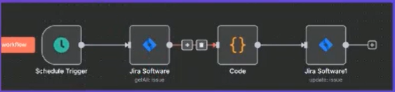
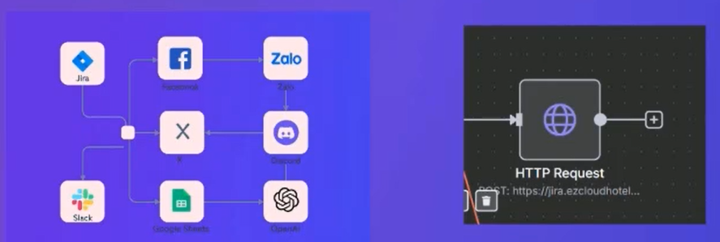
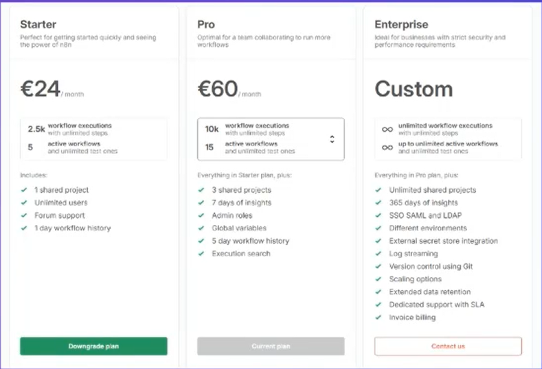

# 2. n8n là gì? Vì sao nên dùng n8n cho doanh nghiệp?
## TABLE OF CONTENTS
- n8n là gì?
- Vì sao nên dùng n8n cho Doanh Nghiệp?
- Các ví dụ trong tự động hóa doanh nghiệp.
- Cài đặt n8n bản cloud và self-hosted
- Làm quen với giao diện và khái niệm cơ bản: `Node`, `Workflow`, `Trigger`, `Expression`

## N8N là gì?
- n8n (viết tắt của `Node for node`) là một nền tảng tự động hóa quy trình công việc (workflow automation) kiểu low-code/no-code.
    - `Node` là gì?
    
    - `Node` trong n8n là một khối chứng năng trong quy trình (workflow), ví dụ: gửi email, lấy dữ liệu từ Google Sheets, gọi API, xử lý điều kiện,v.v
    - Cụ từ `Node for Node` ngụ ý rằng: Bạn có thể xây dựng quy trình tự động một cách trực quan và linh hoạt, từng node một - khối này nối với khối khia - như xếp lego.
- Cho phép người dùng kết nối và điều khiển nhiều ứng dụng khác nhau như Gmail, Google Sheets, Slack, Discord, Facebook, CRM, ERP, API nội bộ ...
    - Hơn 350 ứng dụng được tích hợp sẵn.
    - Không giới hạn số ứng dụng bên ngoài nến biết dùng API.
    - Đây chính là điểm mạnh giúp `n8n` trở thành nền tảng tự động hóa linh hoạt và mạnh mẽ hiện nay.
    
- Được thiết kế để mở rộng và tùy biến cao, hỗ trợ cả người không biết lập trình và lập trình viên chuyên nghiệp.
    - Bạn có thể dùng HTTP Request Node để kết nối với bất kỳ API nào, kể cả hệ thống nội bộ, CRM riêng, phần mềm kế toán, hoặc nền tảng Việt Nam như MISA, KiotViet, Haravan...
    - Có thể tự custom node hoặc chạy script (Javascript) nếu cần xử lý phức tạp hơn.
    
- Có thể chạy trên cloud (n8n cloud) hoặc tự host trên server riêng hoàn toàn miễn phí.
    
- Là mã nguồn mở (open-source) - khác nhiều với nền tảng automation thương mại khác như Zapier, Make...
    - Là phần mềm mà mã nguồn (source code) được công khai và ai cũng có thể xem, sử dụng, sửa đổi hoặc đóng góp vào.
    - Với n8n, bạn có thể:
        - Tải về và cài đặt miễn phí trên máy chủ riêng.
        - Tùy chỉnh theo nhu cầu doanh nghiệp.
        - Không bị phụ thuộc vào nà cung cấp.
    - Ví dụ dễ hiểu: Nếu Zapier/Make giống như bạn thuê phần mềm từ người khác, thì n8n là bạn được tặng luôn bản quyền, bản thiết kế, và muốn sửa gì cũng được.

## DÙNG N8N CHO DOANH NGHIỆP?
### 1. Tự động hóa các quy trình lặp đi lặp lại
- Giảm thời gian xử lý thủ công các tác vụ như nhập liệu, gửi email, tạo báo cáo, thông báo...
- Loại bỏ sai sót do thao tác tay, tăng độ chính xác.

### 2. Tiết kiệm chi phí vận hành
- `n8n` miễn phí khi tự host - không phải trả phí theo số lượt như Zapier, Make.
- Giảm nhu cầu thuê thêm nhân sự để làm các công việc hành chính đơn giản.

### 3. Kết nối linh hoạt hơn 350+ ứng dụng
- Tích hợp sẵn với Gmail, Google Sheets, Notion, Discord, Facebook, Telegram, Twilio, MySQL, PostgreSQL, REST API...
- Có thể kết nối cả hệ thống nội bộ riêng của công ty thông qua API.

### 4. Dễ học, dễ dùng, nhưng cực kỳ mạnh mẽ
- Giao diện kéo-thả trực quan.
- Có thể thêm Javascript hoặc Function Node nếu muốn xử lý logic phức tạp hơp.
- Phù hợp cho cả nhân viên văn phòng lẫn developer.

### 5. Tự chủ dữ liệu và bảo mật
- Nếu tự host, toàn bộ dữ liệu nằm trên hệ thống của bạn - không qua bên thứ ba.
- Phù hợp với doanh nghiệp có yêu cầu cao về bảo mật (như tài chính, y tế, pháp lý...).

### 6. Dễ dàng mở rộng khi doanh nghiệp phát triển
- Workflow có thể nhân bản, tái sử dụng, gắn với bất kỳ hệ thống nào.
- Dễ tích hợp vào chiến lực chuyển đổi số hoặc xây dựng hệ thống vận hành hiện đại. 

## CÁC VÍ DỤ TRONG TỰ ĐỘNG HÓA DOANH NGHIỆP
1. Tự động viết nội dung quảng cáo sản phẩm bằng OpenAI
2. Tự động tạo sơ đồ tổ chức (Org chart) từ Google Sheet
3. Tự động quản lý đơn hàng với webhook, API và email
4. Quản lý cảnh báo bản mật nội bộ
5. Tự động bắt lỗi vi phạm SLA cam kết

# 3. CÀI ĐẶT N8N BẢN CLOUD VÀ SELF-HOSTED
## **1. n8n Cloud (Dễ - Nhanh)**
- Đăng ký và sử dụng tại: n8n.io
- Không cần cài đặt gì.
- Bảo trì và hạ tầng cho n8n lo.
- Có bản miễn phí & bản trả phí.
- Phù hợp với người mới bắt đầu.

## **2. n8n Self-hosted (Chủ động - Mạnh mẽ)**
- Cài đặt trên VPS / Server riêng.
- Dùng docker, npxx, hoặc npm.
- Tự quản lý hạ tầng, bảo mật, dữ liệu.
- Miễn phí hoàn toàn, không giới hạn.
- Phù hợp với doanh nghiệp & người rành kỹ thuật.

# 4. LÀM QUEN GIAO DIỆN VÀ KHÁI NIỆM CƠ BẢN `NODE`, `WORKFLOW`, `TRIGGER`, `EXPRESSION`

- **NODE**
    - Trong n8n, node là một khối chức năng đại diện cho một hành động cụ thể trong quy trình tự động hóa (workflow).
    - Hiểu đơn giản, mỗi `node` giống như một "bước" trong một quy trình.
- **WORKFLOW**
    - Trong n8n, workflow là một chuỗi các hành động (node) được kết nối với nhau để thực hiện một quy trình tự động từ đầu đến cuối.
    - Hiểu đơn giản: Workflow = Dòng công việc tự động, gồm nhiều bước (node) chạy nối tiếp hoặc song song để hoàn thành một nhiệm vụ cụ thể.
- **TRIGGER**
    - Trong n8n, Trigger là điểm bắt đầu của một workflow - tức là nơi kích hoạt để workflow chạy.
- **EXPRESSION**
    - Expression trong n8n là cách để truy cập, xử lý và hiển thị dữ liệu động trong các node của workflow.
    - Nó đơn giản, expression cho phép bạn chèn giá trị biến, kết quả từ node trước, hoặc xử lý logic ngay bên trong ô dữ liệu.
    - Hiểu đơn giản: Công thức động giúp bạn lấy đúng dữ liệu tại đúng chỗ, tự động thay đổi theo từng workflow chạy.